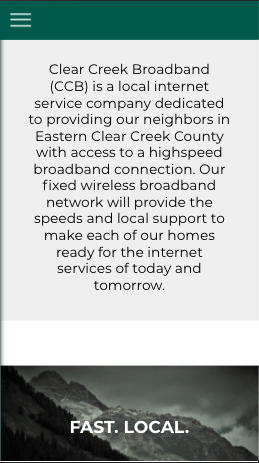
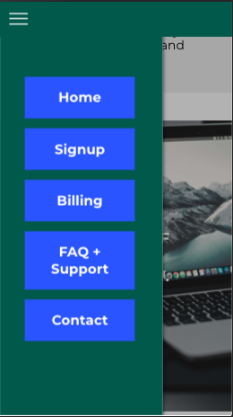
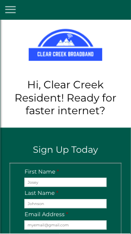

<h1>Clear Creek Broadband API<h1>

*Live*: https://www.clearcreekbroadband.com

## Description

This API supports the website for Clear Creek Broadband (CCB), a local internet service company dedicated to providing their neighbors in Eastern Clear Creek County, Colorado with access to a highspeed broadband connection.  The Signup view form is supported by this API, allowing users an easy channel to request internet service, volunteer to help CCB's effort, and/or join the mailing list to stay updated.

## Routes

/api/contacts

* POST : insert a new contact into the database and returns the new contact (type: object) and its location

## Screenshots

Landing Page Description:

Mobile Navigation:

Signup Form:

## Technology

* Node.js
* Express
* JavaScript
* PostgreSQL
* Testing: Mocha / Chai / Supertest

